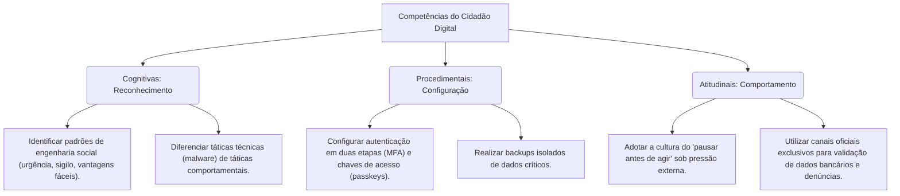

# Projeto Pedagógico do Curso: Cidadão Digital Seguro

## 1. Identificação do Curso
* **Nome Oficial:** Cidadão Digital Seguro: Prevenção e Combate a Crimes Cibernéticos
* **Modalidade:** Educação a Distância (EaD) – 100% Online e Autoinstrucional
* **Tipo:** Curso Livre de Capacitação Cidadã
* **Plataforma Tecnológica:** Aplicação Web Responsiva baseada em React e Vite, executada localmente no navegador do participante com salvamento de progresso via `localStorage` (sem necessidade de cadastro ou banco de dados centralizado).
* **Versão de Referência Curricular:** v3.0.0 (Final)

---

## 2. Justificativa
A digitalização acelerada da sociedade brasileira trouxe inegáveis facilidades no acesso a serviços bancários, consumo, redes sociais e comunicação. No entanto, essa expansão foi acompanhada pelo aumento vertiginoso de fraudes e golpes cibernéticos estruturados em táticas de engenharia social.

Diante desse cenário, a repressão policial pós-fato é necessária, mas insuficiente para conter o volume e a rapidez dos incidentes. A resposta pedagógica baseada em linguagem simples, direta e de orientação preventiva consolida-se como a ferramenta mais eficaz. Capacitar o cidadão comum para reconhecer os sinais de risco e adotar práticas preventivas imediatas protege não apenas o indivíduo, mas fortalece a resiliência coletiva do ecossistema digital.

---

## 3. Público-Alvo
Cidadãos em geral que utilizam computadores e celulares para transações financeiras, compras online, comunicação diária e redes sociais. O curso é desenhado para pessoas sem conhecimento técnico avançado em informática, adotando termos claros da linguagem cidadã e evitando terminologias excessivamente escassas ou científicas do campo da segurança da informação.

---

## 4. Objetivo Geral
Desenvolver no participante a percepção de risco e a autonomia para adotar rotinas seguras de comportamento digital, capacitando-o para identificar golpes financeiros, proteger seus dispositivos e contas, utilizar redes de forma segura e responder adequadamente caso venha a se tornar vítima de um incidente cibernético.

---

## 5. Objetivos Específicos
* **Compreender a Segurança como Responsabilidade Compartilhada:** Reconhecer os papéis de cooperação entre o Estado, o setor bancário, as plataformas de tecnologia e a conduta preventiva do próprio cidadão.
* **Instituir a Higiene Digital como Rotina:** Aplicar mecanismos de autenticação forte, gerenciamento seguro de senhas e rotinas periódicas de backup.
* **Fortalecer o Ambiente Técnico Pessoal:** Configurar roteadores domésticos, redes Wi-Fi e permissões de dispositivos móveis com critérios de segurança.
* **Assegurar Consumo e Transações Financeiras:** Reconhecer fraudes via Pix, boleto bancário falso, QR Codes maliciosos e adotar condutas seguras em compras na internet e marketplaces.
* **Catalogar e Desarmar Engenharia Social:** Identificar tentativas de phishing, falsas centrais de atendimento, clonagem de contas e golpes emocionais.
* **Responder a Incidentes com Método:** Executar medidas imediatas de contenção de danos, preservação de evidências digitais e acionamento célere de canais oficiais e autoridades competentes.

---

## 6. Competências Desenvolvidas

---

## 7. Metodologia Pedagógica
O curso baseia-se na metodologia de **microlearning autoinstrucional**, com conteúdos estruturados em módulos de leitura fluida divididos em etapas curtas. A progressão curricular é sequencial e gamificada por meio de chips e barras de progresso que dependem das seguintes ações do participante:
1. **Vídeoaula:** Assistir à aula em vídeo integrada.
2. **Atividade Prática:** Realizar o exercício ou reflexão propostos.
3. **Leitura Interativa:** Marcar etapas de conteúdo teórico como lidas.
4. **Quiz do Módulo:** Concluir o quiz avaliativo com aproveitamento mínimo.

### Apoio Ludicopedagógico (Avatares Guias)
* **Radar (Orientação Preventiva):** O avatar "Radar" sinaliza dicas práticas, boas condutas e caminhos seguros que o participante deve incorporar em sua higiene cotidiana.
* **Siga (Gestão de Riscos):** O avatar "Siga" sinaliza riscos iminentes, sinais de alerta de fraudes e diretrizes sobre o que evitar em situações sob pressão.

---

## 8. Estrutura Curricular e Carga Horária
O curso tem carga horária equivalente a **20 horas**, distribuída entre os 6 módulos pedagógicos principais e o uso ativo dos recursos auxiliares integrados.

### Módulos Temáticos
1. **Ecossistema de Segurança Digital:** Responsabilidade compartilhada, papéis da Polícia Federal, Ministério da Justiça (MJSP) e FEBRABAN.
2. **Pilares da Higiene Digital:** Gestão de senhas, MFA/Passkeys, backups contra ransomware e privacidade.
3. **Proteção de Dispositivos e Redes:** Segurança física e lógica de celulares (IMEI, bloqueios), computadores e redes Wi-Fi.
4. **Transações e Consumo Seguro:** Prevenção em pagamentos digitais (Pix, boletos), compras seguras e proteção em marketplaces.
5. **Catálogo de Ameaças e Golpes:** Identificação de phishing, falsas centrais, golpes em redes sociais e engenharia social.
6. **Resposta a Incidentes e Denúncia:** Contenção de danos, plano de resposta rápida, preservação de evidências digitais e canais oficiais de denúncia.

### Recursos Transversais de Apoio
* **Glossário Cidadão:** Dicionário interativo com termos comuns da segurança simplificados para fácil fixação.
* **Biblioteca de Documentos:** Acesso direto a fascículos pedagógicos certificados emitidos pelo CERT.br/NIC.br e cartilhas institucionais da Polícia Federal e Ministério da Justiça.
* **Vídeos Educativos:** Curadoria de vídeos informativos oficiais e campanhas contra golpes digitais.
* **Checklists Práticos:** Guias interativos do tipo "o que fazer passo a passo" para situações de segurança preventiva ou emergencial.
* **Simulações Rápidas:** Cenários interativos baseados em casos reais nos quais o participante deve tomar uma decisão sob pressão, recebendo feedback prático e a conduta recomendada imediatamente após a escolha.

---

## 9. Sistema de Avaliação e Aprovação
A avaliação baseia-se em dois eixos obrigatórios de aproveitamento, programados para testar de forma não repetitiva o conteúdo efetivo ensinado:

1. **Quizzes dos Módulos:** Ao final de cada um dos 6 módulos, o aluno realiza um teste de **10 questões de múltipla escolha**, sorteadas dinamicamente a partir de um banco amplo de 30 questões de apoio por módulo (total de 180 questões no banco). O aproveitamento mínimo exigido é de **70%** (7 acertos) para liberar o módulo seguinte.
2. **Avaliação Final Integradora:** Concluídos todos os módulos, o aluno é submetido à avaliação integradora com **18 questões fixas**, cobrindo transversalmente os principais tópicos da trilha curricular. O aproveitamento mínimo para a liberação da certificação é de **70%** (13 acertos).

---

## 10. Certificação e Garantia da Versão
Após atingir o aproveitamento mínimo na Avaliação Final, o participante emite seu certificado de conclusão gerado dinamicamente via biblioteca JavaScript `jspdf`. 
* **Metadados Certificados:** O certificado inclui o nome do aluno, a carga horária de 20 horas, a matriz programática simplificada, e a versão estável da plataforma (**v3.0.0**).
* **Código Verificador:** Contém um código alfanumérico único para fins de auditoria de integridade pedagógica e documental.

---

## 11. Acessibilidade e Inclusão Digital
O curso foi projetado para assegurar o amplo acesso de cidadãos com diferentes capacidades funcionais, aderindo a critérios de acessibilidade como:
* **Navegação por Teclado:** Foco visual claro (`:focus-visible`) e sequencial em botões, chips, links e formulários de avaliação.
* **Estrutura Semântica ARIA:** Utilização de labels acessíveis (`aria-current`, `aria-hidden`) que evitam leituras redundantes e guiam de forma linear usuários de softwares leitores de tela.
* **Design Responsivo e Contraste:** Relação de contraste adequada para leitura confortável no desktop ou em dispositivos móveis sob diferentes condições de luz.

---

## 12. Referências e Fontes Institucionais
O conteúdo pedagógico do curso é alinhado com as publicações e canais das seguintes fontes oficiais:
* **Polícia Federal (Combate a Crimes Cibernéticos e Comunica PF)**
* **Ministério da Justiça e Segurança Pública (MJSP – Aliança Nacional contra Fraudes)**
* **Federação Brasileira de Bancos (FEBRABAN – Portal Anti-Fraude)**
* **Núcleo de Informação e Coordenação do Ponto BR (NIC.br / CERT.br / CGI.br)**
* **Banco Central do Brasil (Diretrizes de Segurança no Pix)**
* **Organização Internacional de Polícia Criminal (INTERPOL – Cyber Safety Campaigns)**

---

## 13. Governança e Manutenção Curricular
Para manter a utilidade e o rigor do curso ao longo do tempo, a governança segue as seguintes diretrizes:
* **Isolamento Curricular:** Proibição de misturar os conceitos e materiais do Cidadão Digital Seguro com projetos paralelos (como o Projeto EaD CIBERCRIME), garantindo foco na linguagem cidadã ampla.
* **Revisão Periódica de Links:** Varredura técnica trimestral das URLs oficiais recomendadas na biblioteca e vídeos para evitar links inativos decorrentes de reestruturações de portais governamentais.
* **Critério de Linguagem:** Preservação estrita do uso de termos institucionais acessíveis e rigor conceitual, por exemplo, preterindo a palavra jurídica "provas" pela terminologia preventiva "evidências digitais" quando direcionado às ações iniciais do cidadão.
